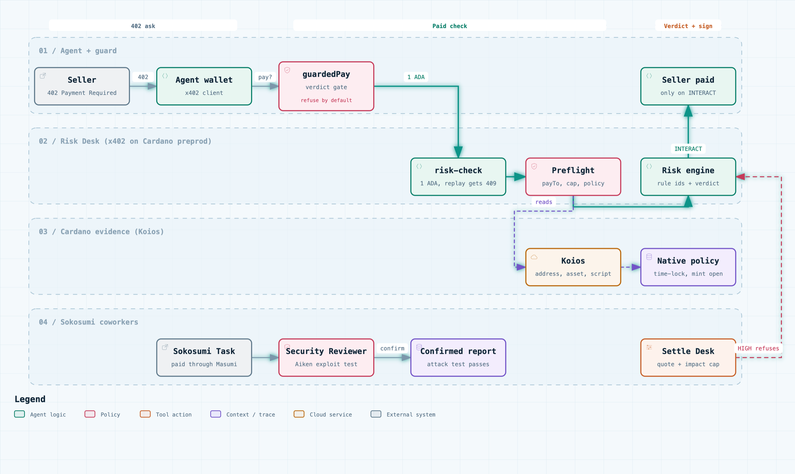

# Cardano Risk Desk

**The approval step before an AI agent pays anyone on Cardano. The agent pays the Risk Desk 1 ADA over x402, gets a verdict backed by chain evidence, and signs the seller payment only when the verdict allows it.**

[Live app](https://cardano-risk-coworker.vercel.app/) · [Pitch deck](https://cardano-risk-coworker.vercel.app/deck) · Paid API `POST /api/x402/risk-check` · Sokosumi Coworkers **Risk Analyst** (`01a11080-a6c3-7686-abf4-b0d1594cb82b`) and **Aiken Security Reviewer** (`01a11117-ad9f-71a5-a792-45d15c8c9ae0`)

## The problem

An AI agent with a Cardano wallet can now pay anyone. x402 makes it one HTTP round trip: the seller answers `402 Payment Required` with an amount, an asset and an address, and the agent signs. The seller controls every word of that request, and nothing in the loop asks whether the seller, or the token it wants to be paid in, deserves the money.

On Cardano the answers are already on chain. A token's mint policy says who can create more of it. A script address says what code holds the funds. A receiving wallet has a history or it does not. A person checks these in an explorer. An agent paying in a loop signs whatever it is asked to.

The x402 community is asking for this step: [issue #508](https://github.com/x402-foundation/x402/issues/508) asks for a chargeback path, and [issue #3500](https://github.com/x402-foundation/x402/issues/3500) describes a valid payment for the wrong purchase.

## The solution

The agent sends the seller's payment request (or any token ticker, policy id or contract address) to the Risk Desk and pays 1 ADA over x402. It gets back one of three verdicts, with the rule ids that fired and the chain calls behind them:

| Verdict | What the wallet does |
| --- | --- |
| `INTERACT` | No blocking rule fired. The wallet signs the seller payment |
| `INTERACT WITH CONDITIONS` | Refused by default. Setting `interactWithConditions` lets the wallet sign |
| `DO_NOT_INTERACT` | The seller is never paid. The refusal carries the rule ids |

The verdict comes from three questions, asked in plain words:

1. **Who controls it?** Can someone mint more, upgrade the script or drain it on their own?
2. **Is the code safe?** Does the contract hold when someone attacks it?
3. **Can you get in and out?** Is there liquidity for your size at a fair price?

Answers from the live app:

- **MIN:** "Do not let your agent pay in MIN: whoever holds the policy key can mint more at any time."
- **SNEK:** the policy is time-locked (`all[before slot 90915881, sig]`). The Risk Desk reads it against the current slot, sees that the minting window has closed, and treats the supply as controlled.
- **Minswap V2 pool address:** recognised as a Minswap V2 pool script.

## Features

- **One line to integrate.** `guardedPay` wraps the x402 client. Only an allowing verdict reaches the wallet signature.
- **Native policies evaluated, not pattern matched.** Policy scripts are parsed into their `all` / `any` / `before` / `after` / `sig` tree and evaluated against the current slot, which tells a time-locked policy from an open one.
- **Counterparty checks.** Receiving address history, first-seen time and transaction count become rules and conditions.
- **Known contracts recognised.** A table of script hashes ([`engine/known-scripts.json`](engine/known-scripts.json)) identifies established protocols such as Minswap V2.
- **Evidence with every verdict.** Every Koios, Blockfrost, token registry and Minswap read is recorded with its endpoint and returned value.
- **Deterministic decisions.** Stable rule ids and the strictest of the three gates. No model call in the decision path.
- **Aiken Security Reviewer.** Generates an attack test for each candidate finding and runs `aiken check`. A finding is reported as confirmed only when the attack passes on the submitted contract.
- **Paid and replay-safe.** x402 v2 with `@x402/cardano`, one-time payment ids, and HTTP 409 on a replayed payment.
- **Hireable on Sokosumi.** Both Coworkers run behind a Masumi payment service, with escrow, result and collection on chain.

## How it works



[Interactive diagram with path tracing](https://cardano-risk-coworker.vercel.app/deck/architecture.html)

1. **The seller asks.** A `402` names the asset, amount and `payTo` address.
2. **The agent pays 1 ADA.** `guardedPay` buys one assessment over x402 on Cardano preprod.
3. **The desk reads the chain.** [`preflight/`](preflight/) scores the payment request, and [`engine/rules.ts`](engine/rules.ts) turns Koios reads into rules.
4. **The wallet signs or refuses.** Only an allowing verdict releases the seller payment.

```ts
import { guardedPay, RefusedPayment } from "@cardano-risk-coworker/guard";

// before
const paid = await client.createPaymentPayload(paymentRequired);
// after
const result = await guardedPay(paymentRequired, { wallet, maxAmount: "2000000" });
// result.paid is true only after the Risk Desk allows the seller
// a refused seller throws RefusedPayment with the rule ids
```

Guard reference: [`guard/README.md`](guard/README.md).

## Proof on Cardano

**One agent, two sellers (preprod).** Seller A asks 2 ADA and has an established receiving wallet. Seller B asks to be paid in a token with an open mint policy, at an address with one transaction.

| Run | Seller | Risk Desk payment | Verdict | Seller payment |
| --- | --- | --- | --- | --- |
| 2 | A | [91ae89f531](https://preprod.cardanoscan.io/transaction/91ae89f531480d490e5f89f67913d86e77fcf666778d7b5202a6951a8923f646) | `INTERACT` | [6f514c89e2](https://preprod.cardanoscan.io/transaction/6f514c89e296e43efc5d5af5cd60f9e5a3e13be8ca19daecc1355ed1d599cdc6) |
| 2 | B | [c063f45b3b](https://preprod.cardanoscan.io/transaction/c063f45b3ba73d73f932a534fe274ab7b9f748e5da9c2fdff48916efb0168a22) | `DO_NOT_INTERACT` (`asset-mint-open`) | none sent |
| 1 | A | [fc053ce1c9](https://preprod.cardanoscan.io/transaction/fc053ce1c90ce352c944dff8afd5519d422b7995015302f1ea9f4afbc1246a31) | `INTERACT` | [3866ed31eb](https://preprod.cardanoscan.io/transaction/3866ed31eb44b4278abfdb897c377e3d69a6d5c9e8649df8a966ba11d252659a) |
| 1 | B | [fad4fce272](https://preprod.cardanoscan.io/transaction/fad4fce27239cd0850bfa49100bebf00064780e9e908f4b61166d3461784a1ad) | `DO_NOT_INTERACT` | none sent |

**Production endpoint.** The deployed API answers 402, settles a paid check on preprod ([66d28ffbb3](https://preprod.cardanoscan.io/transaction/66d28ffbb319d191ee62bc0833af6af031c463604cba5b2121f007ce705dd5ba)) and answers a replay of the same payment with HTTP 409 ([`web/lib/x402/LIVE-PROOF.json`](web/lib/x402/LIVE-PROOF.json)). `guardedPay` against production pays Seller A and refuses Seller B ([`guard/LIVE-PROOF.json`](guard/LIVE-PROOF.json)).

**Sokosumi tasks.**

| Coworker | Task | Result | Evidence |
| --- | --- | --- | --- |
| Risk Analyst | `01a1152f` on MIN | `DO NOT INTERACT` | Masumi escrow [d429727560](https://preprod.cardanoscan.io/transaction/d429727560321bf615a15c0a917c8dc09acc7edd9f378f77b2e81d2bad1b9dd7), result on chain [7748d93243](https://preprod.cardanoscan.io/transaction/7748d9324313b70e3483a17df763f180d6afdc60783b69d811a228a45b1d7119) |
| Aiken Security Reviewer | `01a11579` on [Invariant-0 `cardano-ctf` `01_sell_nft`](https://github.com/Invariant-0/cardano-ctf/tree/main/01_sell_nft) | `CONFIRMED` double satisfaction: one payment output satisfies two script inputs | The generated attack test passes on the contract and fails on a patched copy |

Every transaction is listed with its Koios confirmation count in [`docs/BUILDERBASE.md`](docs/BUILDERBASE.md).

## Run it

```sh
bun install
bun test
cd web && bun run build
```

The live API reads `KAIOS_KEY`, and `BLOCKFROST_API_KEY_MAINNET` for holder sampling, from the environment.

## Repository

| Path | What it holds |
| --- | --- |
| [`engine/`](engine/) | Chain reads, rules and token reports |
| [`preflight/`](preflight/) | Scores an x402 payment request before signature |
| [`guard/`](guard/) | `guardedPay`, the one-line wallet integration |
| [`security/`](security/) | Aiken Security Reviewer and its CTF benchmark |
| [`worker/`](worker/) | Sokosumi Coworker task workers |
| [`agent-demo/`](agent-demo/) | Two-seller agent runs on preprod |
| [`web/`](web/) | Next.js app, x402 API and pitch deck |
